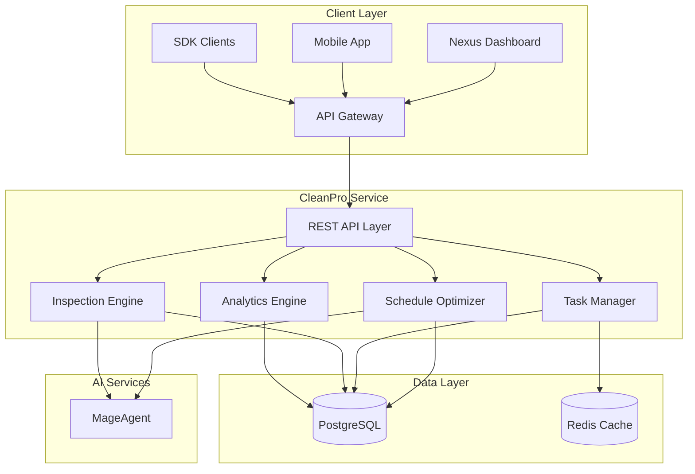
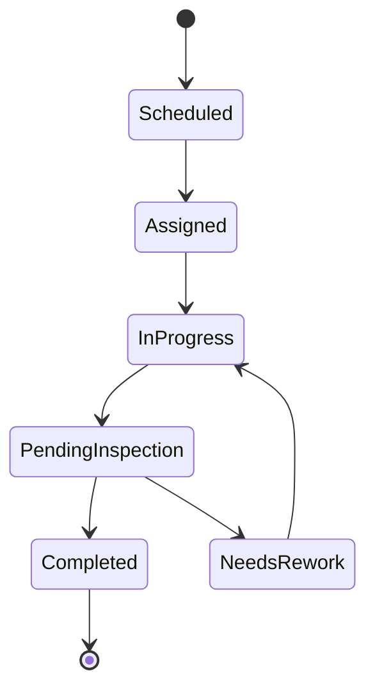
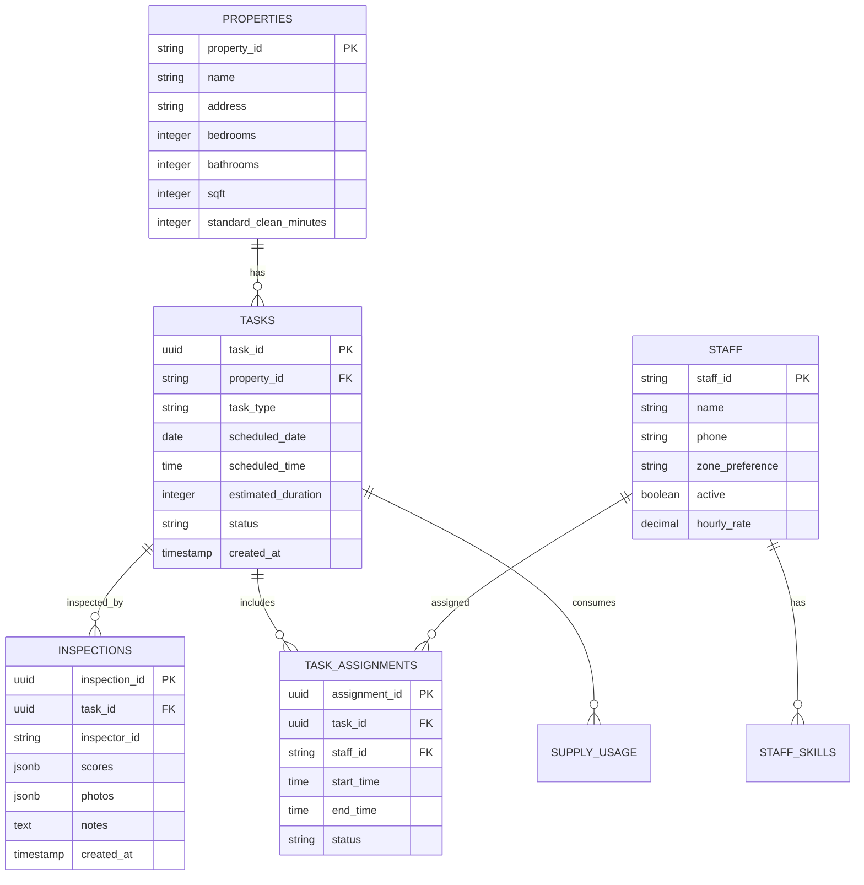
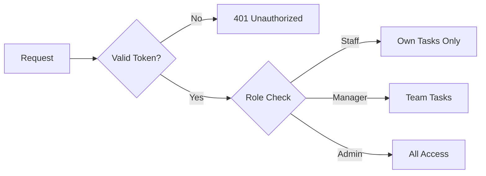
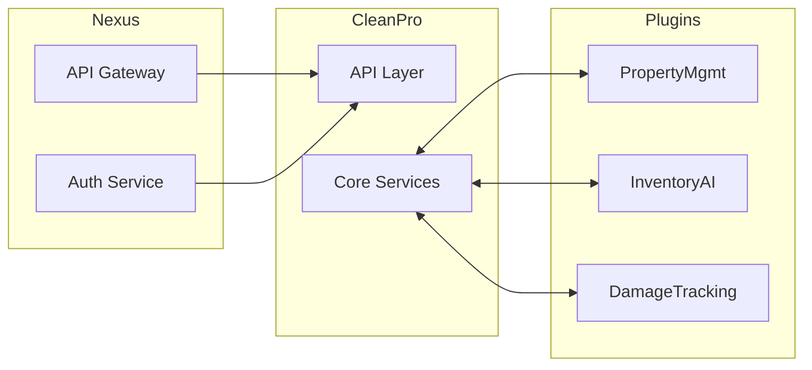

# CleanPro Architecture

Technical architecture and system design for the CleanPro cleaning management plugin.

---

## System Overview



---

## Core Components

### 1. REST API Layer

| Endpoint | Method | Description |
|----------|--------|-------------|
| `/api/v1/schedules/optimize` | POST | Optimize cleaning schedule |
| `/api/v1/tasks` | GET | List cleaning tasks |
| `/api/v1/inspections` | POST | Create inspection report |
| `/api/v1/analytics` | GET | Get performance analytics |

### 2. Schedule Optimizer

AI-powered scheduling engine that considers:

- Property distances and travel times
- Staff skills and certifications
- Checkout/check-in windows
- Property size and cleaning requirements
- Historical completion times

**Optimization Strategies:**
- `minimize_travel`: Reduce total travel distance
- `maximize_efficiency`: Maximize tasks per staff
- `balance_workload`: Even distribution across staff
- `minimize_cost`: Lowest total labor cost

### 3. Task Manager

Real-time task tracking and coordination.



### 4. Inspection Engine

Photo-verified quality control with AI scoring.

**Inspection Areas:**
- Bathroom (toilet, shower, sink, mirrors)
- Kitchen (appliances, counters, floors)
- Bedroom (bed making, dusting, vacuuming)
- Living areas (furniture, floors, windows)

### 5. Analytics Engine

Real-time KPI calculation:

- Tasks completed per day/staff
- Average cleaning time by property type
- Quality scores and trends
- Staff utilization rates

---

## Data Model



---

## Security Model

### Authentication
- Bearer token via Nexus API Gateway
- Staff mobile app uses device-bound tokens
- API key rotation support

### Authorization
- Role-based: Admin, Manager, Staff, Inspector
- Property-level permissions
- Zone-based access control



---

## Deployment Architecture

### Kubernetes Configuration

```yaml
apiVersion: apps/v1
kind: Deployment
metadata:
  name: nexus-cleaning
  namespace: nexus-plugins
spec:
  replicas: 2
  selector:
    matchLabels:
      app: nexus-cleaning
  template:
    spec:
      containers:
      - name: cleaning-api
        image: adverant/nexus-cleaning:1.0.0
        ports:
        - containerPort: 8080
        resources:
          requests:
            memory: "512Mi"
            cpu: "250m"
          limits:
            memory: "1Gi"
            cpu: "500m"
        livenessProbe:
          httpGet:
            path: /live
            port: 8080
        readinessProbe:
          httpGet:
            path: /ready
            port: 8080
```

### Resource Allocation

| Resource | Request | Limit |
|----------|---------|-------|
| CPU | 250m | 500m |
| Memory | 512Mi | 1Gi |
| Disk | 2Gi | 5Gi |

---

## Integration Points

### Nexus Platform



### Event Bus

| Event | Payload | Subscribers |
|-------|---------|-------------|
| `cleaning.task.completed` | Task details | Inventory, Analytics |
| `cleaning.inspection.failed` | Inspection data | Escalation, Notifications |
| `cleaning.schedule.created` | Schedule data | Staff Apps, Calendar |

---

## Performance

### Caching Strategy

- **Schedule Cache**: 5 minute TTL for daily schedules
- **Staff Availability**: Real-time with Redis pub/sub
- **Property Data**: 1 hour TTL

### Rate Limits

| Tier | Requests/min | Concurrent Jobs |
|------|--------------|-----------------|
| Starter | 60 | 5 |
| Professional | 300 | 20 |
| Enterprise | Custom | Custom |

---

## Monitoring

### Metrics (Prometheus)

```
# Task metrics
cleaning_tasks_total{status, type}
cleaning_task_duration_seconds{property_type}
cleaning_inspection_score{property_id}

# Staff metrics
cleaning_staff_utilization{staff_id}
cleaning_staff_tasks_completed{staff_id}
```

### Alerting

| Alert | Condition | Severity |
|-------|-----------|----------|
| Missed Turnover | Task not completed by check-in | Critical |
| Low Quality Score | Average < 80% | Warning |
| Staff Overload | > 8 tasks assigned | Warning |

---

## Next Steps

- [Quick Start Guide](./QUICKSTART.md) - Get started quickly
- [Use Cases](./USE-CASES.md) - Implementation scenarios
- [API Reference](./docs/api-reference/endpoints.md) - Complete docs
