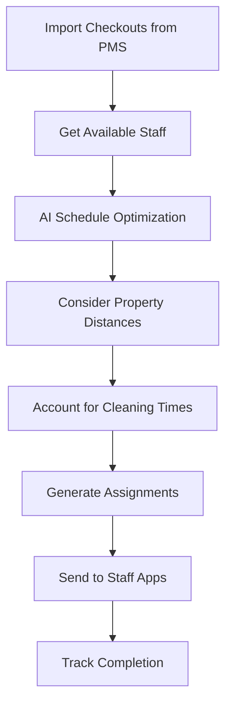
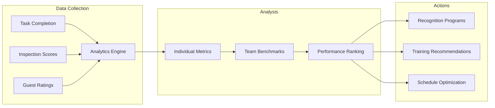

# CleanPro Use Cases

Real-world implementation scenarios for AI-powered cleaning operations management.

---

## Use Case 1: AI-Optimized Turnover Scheduling

### Problem

A vacation rental company managing 50 properties struggles with tight turnover windows between checkout (11 AM) and check-in (3 PM). Manual scheduling leads to missed turnovers, overtime costs, and guest complaints.

### Solution

Deploy CleanPro's AI scheduling engine to optimize staff assignments based on property size, distance, and staff skills.

### Implementation

```typescript
import { NexusClient } from '@adverant/nexus-sdk';

class TurnoverScheduler {
  private cleaning;

  constructor(nexusClient: NexusClient) {
    this.cleaning = nexusClient.plugin('nexus-cleaning');
  }

  async generateDailySchedule(date: string, checkouts: Checkout[]) {
    // Get available staff
    const availableStaff = await this.cleaning.staff.getAvailable({
      date,
      shiftStart: '10:00',
      shiftEnd: '18:00'
    });

    // Generate optimized schedule
    const schedule = await this.cleaning.schedules.optimize({
      date,
      properties: checkouts.map(c => ({
        propertyId: c.propertyId,
        checkoutTime: c.checkoutTime,
        nextCheckinTime: c.nextCheckinTime,
        cleaningType: c.nextCheckinTime ? 'full_turnover' : 'standard',
        priority: c.nextCheckinTime ? 'high' : 'normal'
      })),
      availableStaff: availableStaff.map(s => s.staffId),
      constraints: {
        maxPropertiesPerPerson: 6,
        bufferMinutes: 15,
        preferredZones: true
      },
      optimizeFor: 'minimize_travel'
    });

    // Send assignments to staff
    for (const assignment of schedule.assignments) {
      await this.cleaning.notifications.send({
        staffId: assignment.staffId,
        type: 'schedule_assignment',
        schedule: assignment
      });
    }

    return schedule;
  }
}
```

### Flow Diagram



### Business Impact

- **28% reduction** in cleaning costs
- **Zero missed turnovers** in peak season
- **22% improvement** in staff utilization

---

## Use Case 2: Quality Control with Photo Verification

### Problem

Inconsistent cleaning quality across properties leads to guest complaints and refund requests. No systematic way to verify cleaning standards.

### Solution

Implement photo-verified inspections with AI quality scoring.

### Implementation

```typescript
class QualityControlSystem {
  private cleaning;

  constructor(nexusClient: NexusClient) {
    this.cleaning = nexusClient.plugin('nexus-cleaning');
  }

  async submitInspection(taskId: string, photos: Photo[]) {
    // Upload photos and get AI analysis
    const analysis = await this.cleaning.inspections.analyze({
      taskId,
      photos: photos.map(p => ({
        location: p.location,
        imageUrl: p.url,
        requiredAreas: ['bathroom', 'kitchen', 'bedroom', 'living']
      }))
    });

    // Calculate overall score
    const inspection = await this.cleaning.inspections.create({
      taskId,
      propertyId: analysis.propertyId,
      scores: {
        bathroom: analysis.scores.bathroom,
        kitchen: analysis.scores.kitchen,
        bedroom: analysis.scores.bedroom,
        living: analysis.scores.living,
        overall: analysis.overallScore
      },
      issues: analysis.detectedIssues,
      photos: photos.map(p => p.url)
    });

    // Auto-escalate if below threshold
    if (inspection.scores.overall < 85) {
      await this.cleaning.escalations.create({
        inspectionId: inspection.inspectionId,
        reason: 'below_quality_threshold',
        requiredActions: analysis.recommendedActions
      });
    }

    return inspection;
  }
}
```

### Business Impact

- **15% improvement** in guest satisfaction
- **60% reduction** in quality-related complaints
- **Documented proof** for dispute resolution

---

## Use Case 3: Inventory-Integrated Supply Management

### Problem

Cleaning staff frequently run out of supplies mid-shift, causing delays. Manual supply tracking is inaccurate.

### Solution

Integrate CleanPro with InventoryAI for automatic supply tracking and restocking alerts.

### Implementation

```python
from adverant_nexus import NexusClient
import os

class SupplyIntegratedCleaning:
    def __init__(self, nexus_client: NexusClient):
        self.cleaning = nexus_client.plugin("nexus-cleaning")
        self.inventory = nexus_client.plugin("nexus-inventory")

    async def complete_task_with_supplies(
        self,
        task_id: str,
        supplies_used: list
    ):
        # Complete the cleaning task
        task = await self.cleaning.tasks.complete(
            task_id=task_id,
            completion_time=datetime.now().isoformat(),
            supplies_used=supplies_used
        )

        # Deduct supplies from inventory
        for supply in supplies_used:
            await self.inventory.stock.adjust({
                "sku_id": supply["sku_id"],
                "location_id": task.property_id,
                "adjustment": -supply["quantity"],
                "reason": f"cleaning_task_{task_id}"
            })

        # Check for low stock alerts
        low_stock = await self.inventory.stock.check_thresholds(
            location_id=task.property_id,
            sku_ids=[s["sku_id"] for s in supplies_used]
        )

        if low_stock.alerts:
            # Trigger reorder
            await self.inventory.reorder.create({
                "location_id": task.property_id,
                "items": low_stock.recommended_quantities
            })

        return task
```

### Business Impact

- **Zero supply stockouts** during shifts
- **Accurate cost tracking** per property
- **Automated restocking** workflow

---

## Use Case 4: Staff Performance Analytics

### Problem

No visibility into individual staff performance. Cannot identify top performers or those needing additional training.

### Solution

Implement comprehensive staff analytics with actionable insights.

### Implementation

```typescript
class StaffPerformanceAnalytics {
  private cleaning;

  constructor(nexusClient: NexusClient) {
    this.cleaning = nexusClient.plugin('nexus-cleaning');
  }

  async getStaffScorecard(staffId: string, period: string) {
    const analytics = await this.cleaning.analytics.getStaffPerformance({
      staffId,
      period,
      metrics: [
        'tasks_completed',
        'average_time_per_task',
        'quality_score_average',
        'on_time_completion_rate',
        'reclean_rate',
        'guest_ratings'
      ]
    });

    // Compare to team averages
    const teamBenchmark = await this.cleaning.analytics.getTeamBenchmarks({
      period,
      metrics: analytics.metrics.map(m => m.name)
    });

    return {
      staffId,
      period,
      performance: analytics.metrics.map(metric => ({
        name: metric.name,
        value: metric.value,
        teamAverage: teamBenchmark[metric.name],
        percentile: this.calculatePercentile(metric.value, teamBenchmark)
      })),
      recommendations: analytics.recommendations,
      trainingNeeds: analytics.identifiedGaps
    };
  }

  async identifyTopPerformers(period: string) {
    return await this.cleaning.analytics.getLeaderboard({
      period,
      rankBy: 'composite_score',
      includeMetrics: ['efficiency', 'quality', 'reliability']
    });
  }
}
```

### Flow Diagram



### Business Impact

- **18% productivity improvement** through targeted coaching
- **Reduced turnover** via recognition programs
- **Data-driven** staffing decisions

---

## Use Case 5: Deep Clean Scheduling and Tracking

### Problem

Periodic deep cleans get missed or forgotten. No systematic tracking of when properties were last deep cleaned.

### Solution

Automated deep clean scheduling with compliance tracking.

### Implementation

```typescript
class DeepCleanManager {
  private cleaning;

  constructor(nexusClient: NexusClient) {
    this.cleaning = nexusClient.plugin('nexus-cleaning');
  }

  async checkDeepCleanCompliance() {
    // Get all properties and their last deep clean dates
    const compliance = await this.cleaning.deepClean.getCompliance({
      thresholdDays: 30, // Deep clean required every 30 days
      includeUpcoming: true
    });

    // Schedule overdue deep cleans
    const overdueProperties = compliance.properties.filter(
      p => p.daysOverdue > 0
    );

    for (const property of overdueProperties) {
      const nextAvailableSlot = await this.cleaning.schedules.findSlot({
        propertyId: property.propertyId,
        taskType: 'deep_clean',
        duration: 240, // 4 hours
        priority: property.daysOverdue > 7 ? 'urgent' : 'high'
      });

      await this.cleaning.tasks.schedule({
        propertyId: property.propertyId,
        taskType: 'deep_clean',
        scheduledDate: nextAvailableSlot.date,
        scheduledTime: nextAvailableSlot.startTime,
        estimatedDuration: 240,
        checklist: await this.cleaning.checklists.get('deep_clean')
      });
    }

    return {
      compliant: compliance.compliantCount,
      overdue: overdueProperties.length,
      scheduledThisWeek: compliance.upcomingCount
    };
  }
}
```

### Business Impact

- **100% compliance** with deep clean schedules
- **Automated reminders** and scheduling
- **Audit trail** for property maintenance

---

## Integration with Nexus Ecosystem

CleanPro integrates seamlessly with other Nexus plugins:

| Plugin | Integration |
|--------|-------------|
| **PropertyMgmt** | Sync turnovers with booking calendar |
| **InventoryAI** | Track and reorder cleaning supplies |
| **DamageTracking** | Report damage during inspections |
| **GuestExperience** | Link cleaning quality to guest ratings |

---

## Next Steps

- [Architecture Overview](./ARCHITECTURE.md) - Technical deep-dive
- [API Reference](./docs/api-reference/endpoints.md) - Complete endpoint docs
- [Support](https://community.adverant.ai) - Community forum
